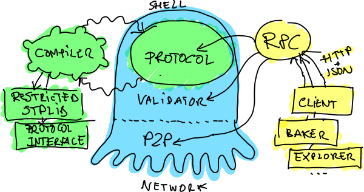
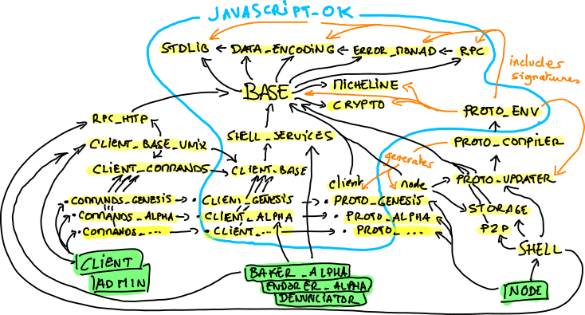

.. _software_architecture:

Tezos Software Architecture
===========================

This document contains two section. The first section, which should be
readable by anyone, describes the main elements of Tezos from a
distance. It abstracts from all plumbing and both internal and system
dependencies to give a simple view of the main components, their
responsibilities and interactions. The second part is written for
developers, and is at the level of OPAM packages.

The Big Picture
---------------
.. _the_big_picture:

The diagram below shows a very coarse grained architecture of Tezos.

|Tezos architecture diagram|

The characteristic that makes Tezos unique is its self-amending
property. The part that amends itself is called the *economic protocol*
(the green eye of the octopus), sometimes abbreviated by protocol or
even proto in the source code. The rest of a Tezos node is what we call
the *shell* (the blue octopus).

The protocol is responsible for interpreting the transactions and other
administrative operations. It also has the responsibility to detect
erroneous blocks.

An important thing to notice is that the protocol always sees only one
block chain. In other words, a linear sequence of blocks since the
genesis. It does not know that it lives in an open network where nodes
can propose alternative heads.

Only the shell knows about the multiple heads. It is responsible for
choosing between the various chain proposals that come from the bakers
(the programs that cook new blocks) of the network. The shell has the
responsibility of selecting and downloading alternative chains, feed
them to the protocol, which in turn has the responsibility to check them
for errors, and give them an absolute score. The shell then simply
selects the valid head of highest absolute score. This part of the shell
is called :ref:`the validator<validation>`.

The rest of the shell includes the peer-to-peer layer, the disk storage
of blocks, the operations to allow the node to transmit the chain data
to new nodes and the versioned state of the ledger. In-between the
validator, the peer-to-peer layer and the storage sits a component
called the distributed database, that abstracts the fetching and
replication of new chain data to the validator.

Protocols are compiled using a tweaked OCaml compiler (green part on the
left of the picture) that does two things. First, it checks that the
protocol’s main module has the right type. A good analogy is to see
protocol as plug-ins, and in this case, it means that it respects the
common plugin interface. Then, it restricts the typing environment of
the protocol’s code so that it only calls authorized modules and
functions. Seeing protocols as plug-ins, it means that the code only
called primitives from the plug-in API. It is a form of statically
enforced sandboxing.

Finally, the RPC layer (in yellow on the right in the picture) is an
important part of the node. It is how the client, third party
applications and daemons can interact with the node and introspect its
state. This component uses the mainstream JSON format and HTTP protocol.
It uses in-house libraries ``ocplib-resto`` and ``ocplib-json-typed``
(via the module :ref:`Data_encoding <data_encoding>`). It
is fully inter-operable, and auto descriptive, using JSON schema.

Software Architecture and Package Relashionships
------------------------------------------------
.. _packages:

The diagram below shows the main OPAM packages present in the source
code of Tezos, and their dependencies. The ``tezos-`` prefix has been
dropped for clarity.

|Tezos source packages diagram|

In green at the bottom are binaries. Highlighted in yellow are the OPAM
packages (sometimes with shortened names). Black arrows show direct
dependencies. Orange arrows show other indirect relationships (code
generation, interface sharing), explained below. The part circled in
blue, contains modules that bear no dependency to Unix, and can thus
be compiled to JavaScript. External dependencies are not shown in this
illustration.

Base and below
~~~~~~~~~~~~~~

At the center, the :package:`tezos-base` package is where
the blockchain specific code starts. Before it are the set of libraries
that are used everywhere for basic operations.

 - :package:`tezos-stdlib` contains a few extensions over the
   OCaml standard library (a few string primitives, an ``Option``
   module, etc.), a few ``Lwt`` utilities, and a ``Compare`` module
   that implements monomorphic comparison operators.
 - :package:`tezos-data-encoding` is the in-house
   combinator-based serialization library. From a single type
   description ``t encoding``, the code can read to and write from
   values of type ``t`` both binary and JSON representations. For
   both, the library provides machine and human-readable documentations
   by the use of documentation combinators. The JSON part depends on
   :opam:`ocplib-json-typed`.
   A :ref:`tutorial<data_encoding>` is available for this library.
 - :package:`tezos-error-monad` is an in-house monadic
   interface to the OCaml ``('a, 'b) result`` type, that fixes the
   ``'b`` to an extensible type ``error`` (actually a list, to hold an
   error trace). When extending the type, programmers must also call
   the ``register_error`` function that registers a pretty printer and
   an encoding for serialization.
   A :ref:`tutorial<error_monad>` is available for this library.
 - :package:`tezos-rpc` provides the basics of Tezos' RPC service
   mechanism. It provides combinators for building service hierarchies
   à la Ocsigen/Eliom, registering and calling services. This module
   is based on :opam:`ocplib-resto`, that allows for automatic
   generation of a machine and human-readable of the hierarchy of
   services: the structure of URLs and the expected formats for input
   and output bodies, via the use of ``data_encoding``.
 - :package:`tezos-crypto` wraps the external cryptography
   libraries that we use. We try to use minimal reference
   implementations, with as thin as possible bindings, and
   rely on libraries from the
   `HACL* project <https://github.com/project-everest/hacl-star>`_,
   written and verified in the F* programming language, and extracted
   to C.
 - :package:`tezos-micheline` is the concrete syntax used by
   Michelson, the language of smart contracts. It mostly contains the
   generic, untyped AST, a printer and a parser.
 - :package:`tezos-base` wraps all these module in a common foundation
   for all the other components of Tezos, and introduces the data
   structures of the blockchain (e.g. ``Block_hash``,
   ``Block_header``, ``Block_locator``, ``Fitness``, ``P2p_identity``)
   that are shared between the shell, economic protocol, client,
   daemons and third party software. It also rewraps some modules from
   ``crypto`` as functors that build all-in-one modules for a given
   type (for instance, the module for block hashes contains all
   possible converters, command line and RPC argument builders, pretty
   printers, an autocompleter, etc.). This package also contains the
   ``cli_entries`` module that we use to handle command line parsing
   in some executables.

The Shell
~~~~~~~~~

The shell is the part of the node responsible for all communications,
peer-to-peer and RPC, acting as a cocoon around the economic
protocols.

  - :package:`tezos-shell-services` contains the definition of the
    node's service hierarchy, and calling functions to use in the
    client (or any third party software). As this library is linked
    into the client to call the services in a type-safe way, only the
    description of services is done here. The registration of handlers
    is done in the rest of the node's implementation.
  - :package:`tezos-rpc-http` uses :opam:`cohttp` to implement the RPC
    over HTTP server and client, allowing to make actual use of
    services declared using :package:`tezos-rpc`.
  - :package:`tezos-p2p` is the in-house peer-to-peer layer.
  - :package:`tezos-storage` contains the raw simple key-value store
    used for the chain data, and the raw versioned key-value store
    used for storing the ledger's context (one version per
    block). This is implemented using :opam:`irmin` and currently
    :package:`lmdb`.
  - :package:`tezos-protocol-updater` maintains the table of available
    protocol versions, embedded or dynamically linked.
  - :package:`tezos-shell` implements the scheduling of block
    validations, the mempool management, and the distributed database.
    A description is available in :ref:`this document<validation>`.

The Economic Protocol Environment and Compiler
~~~~~~~~~~~~~~~~~~~~~~~~~~~~~~~~~~~~~~~~~~~~~~

Economic protocols are compiled by a specific version of the OCaml
compiler. This compiler restricts the set of modules available to the
economic protocol, as a form of static sandboxing. It also generates a
functorized version of the protocol, to make the execution of the
protocol in alternative environment possible.

  - :package:`tezos-protocol-environment-sigs` contains the modules
    that are available to the economic protocol. A review of this
    sandbox is available :ref:`here<protocol_environment>`. This
    modules include a stripped down standard library, and interfaces
    to the crypto APIs, RPC definitions, and key-value store.

  - :package:`tezos-protocol-compiler` is the compiler for economic
    protocols: an alternative driver to the OCaml
    :opam:`ocaml-compiler-libs` that typechecks within the protocol
    environment, and performs some more checks on the protocol code.

  - ``tezos-protocol-xxx`` is produced by the protocol compiler
    and contains a functorized version of protocol ``xxx`` that takes its
    standard library as parameter. This parameter can be filled with
    any of the implementations described in the two points below.

  - :package:`tezos-protocol-environment-shell` is the instance of the
    environment whose RPC service registration and storage access are
    the ones of the node. This is the environment that is fed by the
    node when loading new protocols.

  - :package:`tezos-protocol-environment` contains three alternative
    instances of the protocol environment: one whose context access
    function are dummy ones which can be used when only the types and
    non contextual functions of the protocol are needed, another that
    simulates the key-value store in memory for testing, and a functor
    that let you build an environment from a few context accessors.

  - ``tezos-embedded-protocol-xxx`` contains a version of protocol
    ``xxx`` whose standard library is pre-instantiated to the shell's
    implementation, these are the ones that are linked into the
    node. It also contains a module that registers the protocol in the
    node's protocol table.

The Embedded Economic Protocols
~~~~~~~~~~~~~~~~~~~~~~~~~~~~~~~

Three economic protocols are included in the main Tezos repository.

  - :package:`tezos-protocol-genesis`
    (:package:`tezos-embedded-protocol-genesis`) is the protocol of
    the genesis block. It accepts a single block, signed by a activator
    whose public key is hardcoded, that single action is to switch to
    a new protocol chosen by the activator.
  - :package:`tezos-protocol-alpha`
    (:package:`tezos-embedded-protocol-alpha`) is the first real
    protocol of Tezos. A :ref:`tutorial<entering_alpha>` is available
    to start reading the protocol's code.
  - :package:`tezos-protocol-demo`
    (:package:`tezos-embedded-protocol-demo`) is just a demo protocol
    that does nothing interesting but has the right shape.

The Client Library
~~~~~~~~~~~~~~~~~~

The client is split into many packages, to enforce three separation
lines: shell vs economic protocol, Unix dependent vs Javascript
compatible, and library vs command line interface.

  - :package:`tezos-client-base` define the client context, which is
    an object whose methods allow for: accessing a wallet of keys,
    interacting via the user, making RPC calls, and signing data using
    signer plug-ins. Most of the, including RPC calling functions from
    :package:`tezos-shell-services` and
    :package:`tezos-protocol-alpha`, are abstracted over this object
    type. That way, it is possible to use the same code for different
    platforms or toolkits.
  - :package:`tezos-client-alpha` provides some functions to perform
    the operations of protocol alpha using the wallet and signers from
    the client context.
  - :package:`tezos-client-commands` plugs the basic context access
    functions from :package:`tezos-client-base` as handlers for the
    commands of the ``tezos-client`` command line wallet.
  - :package:`tezos-client-alpha-commands` plugs the functions from
    :package:`tezos-client-alpha` as handlers for the alpha specific
    commands of the ``tezos-client`` command line wallet.
  - :package:`tezos-client-genesis` contains the basic activator
    commands available on the genesis protocol.
  - :package:`tezos-client-base-unix` implements configuration file
    and wallet storage in Unix files, user interaction via the Unix
    console, and terminal based signer plug-ins.

Tests Packages
~~~~~~~~~~~~~~

The tests are split into various packages, testing more and more
elements while following the dependency chain. Use ``make test`` to
run them.

 - :package-name:`tezos-client`
   (in directory :src:`src/bin_client/test/`):
   end-to-end tests as shell scripts that launch a local sandboxed node
   and performs various tasks using the client
 - :package-name:`tezos-p2p`
   (in directory :src:`src/lib_p2p/test/`):
   tests of the peer-to-peer layer, independently of the Tezos gossip
   protocol (establishing connections, propagating peers, etc.)
 - :package-name:`tezos-protocol-environment`
   (in directory :src:`src/lib_protocol_environment/test/`):
   tests for the in-memory context implementation.
 - :package-name:`tezos-shell`
   (in directory :src:`src/lib_shell/test/`):
   tests for the chain data storage.
 - :package-name:`tezos-stdlib`
   (in directory :src:`src/lib_stdlib/test/`):
   tests for the basic data structures.
 - :package-name:`tezos-storage`
   (in directory :src:`src/lib_storage/test/`):
   tests for the versioned key-value context.
 - :package-name:`tezos-protocol-alpha`
   (in directory :src:`src/proto_alpha/lib_protocol/test/`):
   tests of the alpha protocol (without launching a node).
 - :package-name:`tezos-crypto`
   (in directory :src:`src/lib_crypto/test/`):
   tests for the in-house merkle trees.
 - :package-name:`tezos-data-encoding`
   (in directory :src:`src/lib_data_encoding/test/`):
   tests for the JSON and binary serialization and deserialization.

The Final Executables
~~~~~~~~~~~~~~~~~~~~~

  - :package:`tezos-node` provides the node launcher binary
    ``tezos-node``. All the algorithmic being implemented in the
    shell, this package only implements the node's CLI. It also
    provides the sandboxed node shell script launcher (see the main
    readme).
  - :package:`tezos-client` provides the ``tezos-client`` and
    ``tezos-admin-client`` binaries. The former contains a small
    comand line wallet, the latter an administration tool for the
    node. It also provides a shell script that configures a shell
    environment to interact with a sandboxed node.
  - :package:`tezos-baker-alpha` provides the ``tezos-baker-alpha``
    binary.
  - :package:`tezos-endorser-alpha` provides the ``tezos-endorser-alpha``
    binary.
  - :package:`tezos-accuser-alpha` provides the ``tezos-accuser-alpha``
    binary.
  - :package:`tezos-protocol-compiler` provides the
    ``tezos-protocol-compiler`` binary that is used by the node to
    compile new protocols on the fly, and that can be used for
    developing new protocols.

