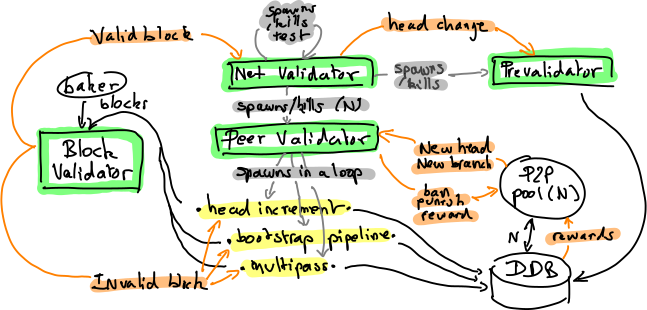

.. _validation:

The validation subsystem
========================

This document explains the inner workings of the validation subsystem
of the Tezos shell, that sits between the peer-to-peer layer and the
economic protocol. This part is in charge of validating chains, blocks
and operations that come from the network, and deciding whether they
are worthy to propagate. It is composed of three main parts: the
:ref:`validator<validator_component>`, the
:ref:`prevalidator<prevalidator_component>`, and
the :ref:`distributed DB<DDB_component>`.

|Tezos validation diagram|

Validator
---------
.. _validator_component:

The validator is the component responsible for checking that blocks
coming from the network or a baker are valid, w.r.t. the rules defined
by the economic protocol, and for selecting the block that it
considers to be the current head of the blockchain.

The validator is written as a collection of workers: local event loops
communicating with each other via message passing. Workers are spawned
and killed dynamically, according to connected peers, incoming blocks
to validate, and active (test)chains.

A *chain validator* worker is launched by the validator for each
*chain* that it considers alive. Each chain validator is responsible for
handling blocks that belong to this chain, and select the best head for
this chain. A main chain validator is spawned for the main chain that
starts at the genesis, a second one when there is an active test
chain. Forking a chain is decided from within the economic protocol.  In
version Alpha, this is only used to try new protocols before self
amending the main chain.

The chain validator spawns one *peer validator* worker per connected
peer. This set is updated, grown or shrunk on the fly, according to the
connections and disconnections signals from the peer-to-peer component.
Each peer validator will treat new head proposals from the associated
peer, one at a time, in a loop. In the simple case, when a peer
receives a new head proposal that is a direct successor of the current
local head, it launches a simple *head increment* task: it retrieves
all the operations and triggers a validation of the block. When the
difference between the current head and the examined proposal is
more than one block, mostly during the initial bootstrap phase, the
peer worker launches a *bootstrap pipeline* task.

A third scheme is planned (but not yet implemented) for validating
alternative chains: the *multipass validator*. This method is quite more
complex, its goal is to detect erroneous blocks as soon as possible,
without having to download all the chain data. This will work by first
validating the block headers, then the operations that act on the
fitness, and finally the remaining operations. The mechanism is
actually a bit more flexible, and allows for an arbitrary number of
lists of operations. The shell will only consider forks of a given
length, that is exported by the protocol, so that block headers and
operations are validated in the context of an ancestor block that is
in a close enough time window. In version Alpha, the check performed
on block headers is that the baking slots, baker signatures and
timestamp deltas are right. It can also detect too large fitness gaps,
as the fitness difference between two consecutive blocks is bounded in
Alpha. The operations that act on fitness are endorsements, whose
checks consist in verifying the endorsement slots and endorsers'
signatures. For that to be sound, the fork limit is set to not allow
rewinding before the baking and endorsing slots are set.

Each of these three peer validator tasks (head increment, bootstrap
pipeline or multipass) will interact with the distributed DB to get
the data they need (block headers and operations). When they have
everything needed for a block, they will call the *block validator*.

The *block validator* validates blocks (currently in sequence),
assuming that all the necessary data have already been retrieved from
the peer-to-peer network. When a block is valid, it will notify the
corresponding chain validator, that may update its head. In this case,
the chain validator will propagate this information to its associated
*prevalidator*, and may decide to kill or spawn the test network
according to the protocol's decision.

Prevalidator
------------
.. _prevalidator_component:

To each chain validator is associated a *prevalidator* (this may become
an option in the future, to allow running nodes on machines with less
RAM), that is responsible for the transmission of operations for this
chain over the peer-to-peer network.

To prevent spam, this prevalidator must select the set of operations
that it considers valid, and the ones that it chooses to broadcast.
This is done by constantly baking a dummy block, floating over the
current head, and growing as new operations are received.

Operations that get included can be broadcast unconditionally.

Operations that are included are classified into categories. Some
(such as bad signatures or garbage byte sequences) are dismissed. They
are put in a temporary bounded set for quick rejection, and the peer
that sent it is kicked. Some other operations are temporarily refused:
they come too soon or too late. For instance, in Alpha, contracts have
counters, and operations with counters in the future are classified as
temporarily refused. A malicious peer could easily flood the mempool
with such operations, so they are put in a bounded set. Another
bounded set is also kept for a third kind of non inclusion: operations
that could be valid in another branch.

Distributed DB
--------------
.. _DDB_component:

The gathering of resources needed for validation is centralized in the
*distributed db*. This component allocates a slot per requested
resource, whose priority depends on the number of peer validators
requesting it.

